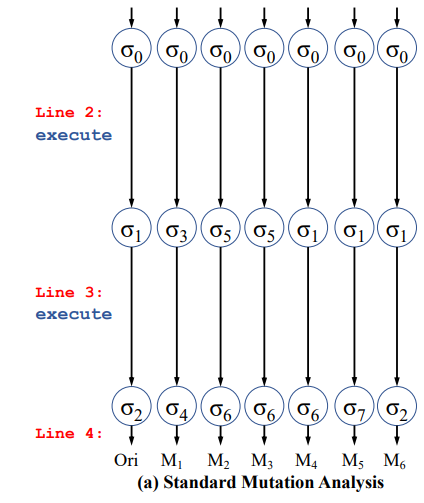
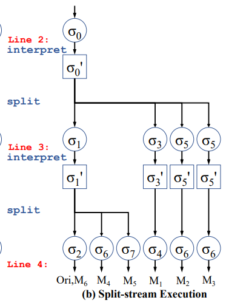

# WinMut2

## 主要目标

1. 扩展变异处理范围
2. 使用静态方法加速程序状态划分

## Example for quick start

[WinMut-README.md](WinMut-README.md)

## 领域历史

### 用途

### 方法进化

一阶变异
: 一个变体最多包含一个变异点  

*以下方法针对一阶变异*

1. Standard Mutation Analysis

   最简单的方法是什么？  
   为每个修改（变异体）都生成一个程序，分别执行。  
   

2. Split-stream Execution

   遇到变异点之前的程序不都一样吗？  
   先执行一个进程，等到变异点出现时，再分出子进程来执行（通过fork）。  
   

3. AccMut  

   分出的子进程真彼此不同吗？
   程序执行的唯一依据就是对数据的修改，`int c = a + b`和`int c = a - b`或许在语义上不同，但从程序执行的角度而言（即程序状态），当`b = 0`时，此处的两个变异体是不需要分出子进程的。

4. WinMut
  
## WinMut2设计

### Definition

变异点
: ？？？

变异体
: ？？？

进程树
: ？？？

子进程树
: ？？？

---

WinMut2主要包括两方面：

1. 扩大分析范围
   - 语句级
   - 更多？
2. 使用静态规则剪枝

### 1. 扩大分析范围

AccMut的剪枝体现在：

引入程序状态概念，通过在**运行时**对不同变异点但导致了同一程序状态（对后续程序运行的影响相同）的归类划分，剪枝。

``` c
mut1: int c = a + b;
mut2: int c = a - b;

// 当`b=0`时，这两个变异点的子进程树是完全一致的。
```

- SSA语句解释？

WinMut的剪枝体现在？？？

- 只跟踪对比有效变量
- 针对一阶变异，真正实现降低分析的数量级

  当已经进行解释过一个变异点后，后面的变异都不再解释，直接执行，将问题规模从指数级降为线性。

更多：

1. 设计新的对程序状态的分析对比方法来支持分析范围的扩大

   - 校验和？

## More Infomation

- <https://llvm.org/docs/CodingStandards.html>
- <https://llvm.org/doxygen/>

## TODO

- [x] 理解WinMut代码流程
  - [x] 阅读AccMut源码
    - [x] 变异分析
    - [x] 变异生成
  - [x] ~~调试AccMut输出（放弃调试链接问题，直接调试WinMut代码输出）~~
    - [x] 调试输出
    - [x] 断点调试
- [ ] 查看WinMut源码
  - [ ] 执行流程
  - [ ] 变异生成
  - [ ] 变异分析
  - [ ] 内置入llvm
  - [ ] 量化数据
  - [ ] *可视化
  - [ ] 调试、统计与分析
    - [ ] 设计简单的测试集
    - [ ] 无关变量优化  VS 只使用方法一
    - [ ] 无关变量优化+方法二 VS 方法一+方法二
- [ ] WinMut2
  - [ ] 范围扩大
    - [ ] 语句级
  - [ ] 静态规则
  - [ ] 统计时间
    - [ ] 在各个部分加上计时器

## KEEP IN MIND

- 将pass作为插件
- 使用宏定义/编译选项来控制分析范围或启用静态分析规则
- 统计分析
   1. pass运行时间
   2. 编译出的程序运行时间
   3. 性价比
- 对比解释和程序执行位置的关系（比如，当程序执行到最后一步，也许直接执行比解释更高效）

## 日报

- 2023-10-10

  使用DEBUG宏+GDB调试

- 2023-10-09

  查看WinMut源码执行流程

- 2023-10-08

  阅读AccMut的变异生成源码

- 2023-10-07

  搭建AccMut调试（llvm的gdb调试）

- 2023-10-06

  阅读算术变异插入源码，尝试GDB调试AccMut

- 2023-10-04

  阅读调试AccMut源码。  
  由于链接文件问题放弃调试AccMut输出，但仍可以查看其对IR的修改过程作为理解LLVM的入门。

- 2023-10-03

  针对Pass修改增量编译，构建AccMut

- 2023-10-02

  编译llvm

- 2023-09-29

  创建git项目
